# Java 线程生命周期 · 面试完整指南

> 本文按对话模块整理：从图解详解 → 口述版 → 常见追问 → 模拟连问 + 速记卡 → 追问树状图，适合系统复习与面试前速览。

---

## 目录

- [模块一：结合图解的详细讲解](#模块一结合图解的详细讲解)
- [模块二：口述版（5 分钟 / 1 分钟）](#模块二口述版5-分钟--1-分钟)
  - [2.1 1 分钟精简版](#21-1-分钟精简版)
  - [2.2 5 分钟口述版](#22-5-分钟口述版)
- [模块三：常见追问标准答法](#模块三常见追问标准答法)
- [模块四：模拟面试 10 连问 + A4 速记卡](#模块四模拟面试-10-连问--a4-速记卡)
  - [4.1 模拟面试 10 连问](#41-模拟面试-10-连问)
  - [4.2 A4 速记卡（纯 Bullet）](#42-a4-速记卡纯-bullet)
- [模块五：面试官追问树状图](#模块五面试官追问树状图)
  - [5.1 总览树（Mermaid）](#51-总览树mermaid)
  - [5.2 分支详解与答题路径](#52-分支详解与答题路径)
  - [5.3 高频追问链（3 条典型路径）](#53-高频追问链3-条典型路径)
  - [5.4 追问树使用技巧](#54-追问树使用技巧)

---

## 模块一：结合图解的详细讲解

### 1.1 整体认识

Java 线程从创建到销毁，会经历多个状态。下图把线程生命周期拆得比较细，核心可以概括为 **7 个区域**：


| 区域 | 含义 |
|------|------|
| **New（新建）** | 对象已创建，尚未启动 |
| **Runnable（可运行）** | 已就绪，等待 CPU 调度 |
| **Running（运行）** | 正在执行字节码 |
| **Blocked（阻塞）** | 因 sleep/join/I/O 等暂停，**不释放锁** |
| **Waiting Queue（等待队列）** | 调用 `wait()` 后进入，**会释放锁** |
| **Lock Pool（锁池）** | 竞争 synchronized 锁时排队 |
| **Dead（死亡）** | 线程结束，不可复活 |

> **面试加分点**：JDK 里 `Thread.State` 只有 6 种状态，没有单独的 **Running**——运行中和就绪在 JVM 里都叫 **RUNNABLE**。本图是为了教学，把「就绪」和「真正占用 CPU」拆开了，逻辑上是对的。

---

### 1.2 各状态详解

#### （1）New（新建）

```java
Thread t = new Thread(() -> { /* ... */ });
```

- 只创建了 `Thread` 对象，**还没有真正的 OS 线程**
- 此时调用 `run()` 只是普通方法调用，**不会启动新线程**
- 正确启动方式：`t.start()`

#### （2）Runnable ↔ Running（可运行 ↔ 运行）

- **New → Runnable**：调用 `t.start()` 后，JVM 会创建系统线程，进入就绪队列
- **Runnable → Running**：线程调度器分配时间片，线程真正在 CPU 上执行
- **Running → Runnable** 的常见原因：
  - 时间片用完，被抢占
  - 主动让出 CPU：`Thread.yield()`（只是建议调度器让出，不保证立刻切换）

> **面试要点**：Runnable 和 Running 的切换完全由 OS 线程调度决定，应用代码无法精确控制「何时从就绪变为运行」。

#### （3）Blocked（阻塞 — 不释放锁）

图中粉色 **Blocked/Waiting** 标注了：**doesn't release any lock（不会释放锁）**。

从 **Running** 进入 Blocked 的典型场景：

| 触发方式 | 说明 |
|----------|------|
| `Thread.sleep(ms)` | 指定时间休眠，**仍持有已获得的 synchronized 锁** |
| `t2.join()` | 等待 t2 执行完毕 |
| I/O 阻塞 | 如等待用户输入、网络/磁盘读写 |

从 **Blocked → Runnable**：条件满足后回到就绪队列，再次竞争 CPU：

- sleep 时间到
- join 的目标线程结束
- I/O 完成

> **关键**：sleep / join 不会让线程释放 synchronized 锁。若在同步块里 sleep，其他线程仍拿不到这把锁。

#### （4）Lock Pool（锁池）与 Waiting Queue（等待队列）

这是图里最容易考到的部分，也是 **synchronized + wait/notify** 的经典模型。

**Running → Lock Pool**

线程执行到 `synchronized(obj)`，但 **obj 的监视器锁已被其他线程占用**，当前线程进入 **锁池** 排队，状态在 JDK 里对应 **BLOCKED**。

**Lock Pool → Runnable**

锁被释放后，锁池中某个线程竞争成功，**拿到锁标识**，回到 Runnable，再等调度运行。

**Running → Waiting Queue（会释放锁）**

线程**已经持有锁**，在同步块内调用：

```java
synchronized (obj) {
    obj.wait();  // 进入等待队列，并释放 obj 的锁
}
```

- 进入 **Waiting Queue**
- **立即释放 monitor 锁**，让其他线程可以进入 synchronized
- JDK 对应 **WAITING**（无超时）或 **TIMED_WAITING**（`wait(timeout)`）

**Waiting Queue → Lock Pool（注意：不是直接 Runnable）**

其他线程在同步块内调用：

```java
synchronized (obj) {
    obj.notify();      // 唤醒一个
    // 或 obj.notifyAll();  // 唤醒全部
}
```

被唤醒的线程**不会马上运行**，而是：

1. 从等待队列移到 **锁池**
2. 必须**重新竞争锁**
3. 拿到锁后才回到 Runnable，再等 CPU 调度到 Running

> **面试高频**：notify 之后线程还在锁池里等锁，不会立刻执行 wait 之后的代码。

#### （5）Dead（死亡）

线程进入 **Dead** 后不可复活，`start()` 也不能再调。

| 路径 | 说明 |
|------|------|
| 正常结束 | `run()` 或 `main()` 执行完毕 |
| 异常退出 | 未捕获异常导致线程终止 |

---

### 1.3 简化流程图

```
                    start()
    [New] ──────────────────→ [Runnable] ←──────────┐
                                  │  ↑                │
                          获得时间片│  │时间片用完/yield │
                                  ↓  │                │
                              [Running]                 │
                    ┌─────────────┼─────────────┐       │
                    │             │             │       │
              sleep/join/I/O   wait()    抢锁失败       │
                    │             │             │       │
                    ↓             ↓             ↓       │
               [Blocked]   [Waiting Queue]  [Lock Pool]──┘
                    │             │             ↑
                    │        notify/notifyAll ──┘
                    └─────────────┴──→ 条件满足 / 拿到锁 → Runnable

    [Running] ── run结束 / 未捕获异常 ──→ [Dead]
```

---

### 1.4 与 JDK 官方 `Thread.State` 对照

| 图中概念 | `Thread.State` | 典型 API |
|----------|----------------|----------|
| New | `NEW` | `new Thread()` |
| Runnable + Running | `RUNNABLE` | `start()`、调度运行 |
| Lock Pool | `BLOCKED` | 竞争 synchronized 失败 |
| Waiting Queue（无限等待） | `WAITING` | `wait()`、`join()`、`LockSupport.park()` |
| Blocked（限时等待） | `TIMED_WAITING` | `sleep()`、`wait(timeout)`、`join(timeout)` |
| Dead | `TERMINATED` | 运行结束 |

---

### 1.5 三个核心对比（结合图记忆）

#### sleep vs wait

| | sleep | wait |
|---|-------|------|
| 所属类 | `Thread` | `Object` |
| 是否释放锁 | **不释放** | **释放** |
| 唤醒方式 | 时间到自动醒 | 需 `notify/notifyAll` |
| 使用位置 | 任意处 | 必须在 synchronized 内 |

#### BLOCKED vs WAITING

- **BLOCKED**：还没拿到锁，在 **Lock Pool** 等锁
- **WAITING**：已拿到锁后主动 `wait()`，在 **Waiting Queue** 等通知

#### 为什么 notify 后还要经过 Lock Pool？

因为 **notify 的线程仍持有锁**（在 synchronized 块里）。被唤醒线程要执行 wait 之后的代码，必须先重新获得同一把锁，所以路径是：

**Waiting Queue → Lock Pool → 拿到锁 → Runnable → Running**

---

### 1.6 一句话总结

> Java 线程生命周期本质是：**创建 → 就绪/运行（调度）→ 因 I/O、sleep、join、锁竞争、wait 等进入不同等待形态 → 条件满足回到就绪 → 运行结束死亡**。
>
> 理解本图的关键是分清三类等待：**不释放锁的阻塞（Blocked）**、**释放锁的 wait 等待队列**、**抢锁失败的锁池**，以及它们回到 **Runnable** 后再由调度器决定是否 **Running**。

---

## 模块二：口述版（5 分钟 / 1 分钟）

### 2.1 1 分钟精简版

> **适用场景**：「简单说一下线程状态」/ 时间紧张时的开场

**口述稿（约 45–60 秒）**：

> Java 线程从创建到结束，核心就是几个状态和转换。
>
> 先用 `new Thread()` 创建，此时是 **New**；调用 `start()` 后进入 **Runnable**，等 CPU 调度真正跑起来就是 **Running**。Runnable 和 Running 在 JDK 里都叫 RUNNABLE，只是教学上拆开讲。
>
> 运行中可能进入几种等待：**sleep、join、I/O** 会阻塞，但 **不释放锁**；竞争 synchronized 失败会进 **锁池**；在同步块里 **wait()** 会进等待队列并 **释放锁**，需要 notify 唤醒。
>
> 注意：notify 之后线程不会立刻运行，要先回锁池抢锁，再回到 Runnable 等调度。run 执行完或抛未捕获异常，线程就 **Dead**，不能复活。
>
> 面试最常考：**sleep 不释放锁，wait 释放锁**；BLOCKED 是抢锁失败，WAITING 是 wait 主动等通知。

---

### 2.2 5 分钟口述版

> **适用场景**：「结合 synchronized / wait/notify 讲线程生命周期」

#### 【0:00 – 0:30】开场 + 总览

> 面试官您好。Java 线程生命周期，我按 **创建 → 调度运行 → 各类等待 → 结束** 这条主线来讲。
>
> 如果结合那张状态图，可以分成：**New、Runnable、Running、Blocked、Waiting Queue、Lock Pool、Dead** 七个概念。其中 Runnable 和 Running 在 JDK 的 `Thread.State` 里合并成一个 **RUNNABLE**，图是为了把「就绪」和「真正占用 CPU」分开，方便理解。

#### 【0:30 – 1:15】New → Runnable → Running

> 第一步，**New**：`new Thread()` 只是创建了对象，还没有 OS 线程，这时调 `run()` 只是普通方法，不会起新线程。
>
> 第二步，调 **`start()`** 进入 **Runnable**，线程就绪，在就绪队列里等调度。
>
> 第三步，调度器分配时间片，线程进入 **Running** 真正执行。时间片用完或被更高优先级线程抢占，会回到 Runnable；`Thread.yield()` 也是建议让出 CPU，不保证立刻切换。
>
> 所以：**Runnable 和 Running 的切换是 OS 调度决定的，代码控制不了「何时从就绪变运行」**。

#### 【1:15 – 2:15】Blocked：不释放锁的阻塞

> 运行中可能进入 **Blocked**，图里标注了 **不会释放锁**。
>
> 典型三种情况：
> 1. **`Thread.sleep()`** — 睡指定时间
> 2. **`join()`** — 等另一个线程结束
> 3. **I/O 阻塞** — 比如等用户输入、网络读写
>
> 条件满足后回到 **Runnable**，再等 CPU，不会直接进 Running。
>
> 重点：**sleep 和 join 都不释放 synchronized 锁**。若在同步块里 sleep，其他线程仍拿不到这把锁。JDK 里 sleep 对应 **TIMED_WAITING**，join 无参版对应 **WAITING**。

#### 【2:15 – 3:30】Lock Pool 与 Waiting Queue（重点）

> 和 synchronized 相关的等待，图里分两块，这是高频考点。
>
> **Lock Pool（锁池）**：线程执行到 `synchronized(obj)`，锁被占用，进锁池排队，对应 JDK 的 **BLOCKED**。锁释放后竞争成功，回到 Runnable。
>
> **Waiting Queue（等待队列）**：线程**已持有锁**，在同步块里调 **`obj.wait()`**，会释放锁并进入等待队列，对应 **WAITING** 或带超时的 **TIMED_WAITING**。
>
> 唤醒靠 **`notify()` 或 `notifyAll()`**，且必须在 synchronized 里调用。
>
> 关键路径：**wait 的线程被 notify 后，不会立刻运行**，而是先移到 **Lock Pool 重新抢锁**，拿到锁才回 Runnable，再等调度到 Running。因为 notify 时，notify 线程还持有锁。
>
> 所以完整路径是：**Running → wait → Waiting Queue → notify → Lock Pool → 拿到锁 → Runnable → Running**。

#### 【3:30 – 4:15】Dead + 与官方枚举对照

> 线程结束进 **Dead**：`run()` 或 `main()` 正常跑完，或未捕获异常。之后不能 `start()`，不能复活。
>
> 和 JDK 六种状态对照：
> - New → **NEW**
> - Runnable + Running → **RUNNABLE**
> - 锁池 → **BLOCKED**
> - wait 无限等 → **WAITING**
> - sleep / wait(timeout) → **TIMED_WAITING**
> - Dead → **TERMINATED**

#### 【4:15 – 5:00】三个对比 + 收尾

> 最后三个对比，帮助记忆：
>
> **第一，sleep vs wait**：sleep 是 Thread 的方法，不释放锁，时间到自动醒；wait 是 Object 的，释放锁，必须 notify 唤醒，且要在 synchronized 里用。
>
> **第二，BLOCKED vs WAITING**：BLOCKED 是**还没拿到锁**，在锁池等；WAITING 是**已经拿到锁后**主动 wait，等通知。
>
> **第三，Blocked 和 Waiting Queue**：前者 sleep/join/I/O，**不释放锁**；后者 wait，**释放锁**。
>
> 总结一句：**线程生命周期就是不断在 Runnable 和各类等待之间切换，最终运行结束进入 Dead；理解的关键是分清「不释放锁的阻塞」「释放锁的 wait」「抢锁失败的锁池」这三种等待。**
>
> 以上是我的理解，您看需要我再展开 ReentrantLock 和 Condition 吗？

#### 口述版选用建议

| 场景 | 用哪个 |
|------|--------|
| 「简单说一下线程状态」 | **1 分钟版** |
| 「结合 synchronized / wait/notify 讲生命周期」 | **5 分钟版** 第 2、3 段 |
| 追问「notify 后线程在哪」 | **Waiting Queue → Lock Pool → Runnable** |
| 追问「sleep 会不会释放锁」 | **1 分钟版最后一句** |

---

## 模块三：常见追问标准答法

> **答题结构**：一句话结论 → 展开 → 加分点

---

### 一、状态与转换类

#### Q1：`start()` 和 `run()` 有什么区别？

**结论**：`start()` 启动新线程；`run()` 只是普通方法调用。

**展开**：
- `start()` 只能调一次，会走 JVM 原生逻辑创建 OS 线程，状态 New → Runnable
- 直接调 `run()` 在当前线程里执行，没有新线程，状态不会变
- 重复 `start()` 抛 `IllegalThreadStateException`

---

#### Q2：Runnable 和 Running 有什么区别？JDK 为什么只有 RUNNABLE？

**结论**：Runnable 是就绪等 CPU；Running 是真正占用 CPU 执行。JDK 不区分，都叫 RUNNABLE。

**展开**：
- 就绪 ↔ 运行由 OS 调度决定，Java 层拿不到「正在 Running」的精确状态
- `Thread.getState()` 看到 RUNNABLE，可能是就绪，也可能在跑，也可能在等 I/O

**加分点**：Linux 上 RUNNABLE 的线程，有的在 run queue，有的在等 native I/O，但 JVM 统一报 RUNNABLE。

---

#### Q3：`yield()` 有什么用？线程状态变吗？

**结论**：建议当前线程让出 CPU，状态通常仍是 RUNNABLE，不保证立刻切换。

**展开**：
- 只是给调度器的 hint，可能被忽略
- 不会让线程进入 BLOCKED/WAITING，也不释放锁
- 现代 JVM 里用得少，更多靠时间片调度

---

#### Q4：线程执行完能复活吗？`start()` 能调两次吗？

**结论**：不能。TERMINATED 后不可复活，`start()` 只能调一次。

**展开**：
- 想复用逻辑应提交任务到线程池，而不是复用同一个 Thread 对象
- 线程池是复用 worker 线程跑多个 Runnable，不是把 Dead 线程拉回来

---

### 二、sleep / wait / join 类（最高频）

#### Q5：`sleep()` 会释放锁吗？

**结论**：**不会**。

**展开**：
- `Thread.sleep()` 只是让当前线程暂停指定时间
- 若在 `synchronized` 块里 sleep，仍持有 monitor，其他线程进不了同步块
- 状态：**TIMED_WAITING**（不消耗 monitor）

---

#### Q6：`wait()` 和 `sleep()` 的区别？

**结论**：wait 释放锁、需 notify 唤醒、必须在 synchronized 里；sleep 不释放锁、时间到自动醒、哪都能用。

| 对比项 | wait | sleep |
|--------|------|-------|
| 所属 | Object | Thread |
| 释放锁 | 是 | 否 |
| 唤醒 | notify/notifyAll | 时间到 |
| 使用位置 | synchronized 内 | 任意 |
| 典型状态 | WAITING / TIMED_WAITING | TIMED_WAITING |

**加分点**：`wait()` 被 interrupt 会抛 `InterruptedException` 并退出等待；sleep 同理。

---

#### Q7：为什么 `wait()` 必须在 synchronized 里？

**结论**：防 lost wakeup（唤醒丢失）+ 保证「检查条件」和「进入等待」的原子性。

**展开**：

```java
synchronized (obj) {
    while (!condition) {  // 用 while，不用 if
        obj.wait();
    }
}
```

- 必须先持有锁，才能释放锁并进入等待队列
- 用 **while** 是因为被唤醒后条件可能仍不满足（虚假唤醒、被别的线程改了条件）

---

#### Q8：`notify()` 和 `notifyAll()` 怎么选？

**结论**：不确定被唤醒线程能否继续执行时，用 `notifyAll()`；明确只有一个线程满足条件时用 `notify()`。

**展开**：
- `notify()` 随机唤醒一个（JDK 不保证 FIFO）
- 被唤醒线程：**Waiting → 锁池抢锁 → Runnable**，不会立刻执行 wait 后面代码
- 生产环境更常用 `notifyAll()` + while 循环，避免漏唤醒或唤醒错线程

---

#### Q9：`notify()` 之后，被唤醒的线程立刻运行吗？

**结论**：**不会**。先进入锁池竞争锁，拿到锁后才回到 Runnable，再等 CPU。

**展开**：

```
Waiting Queue → Lock Pool → 拿到锁 → Runnable → Running
```

这是面试最高频追问之一。

---

#### Q10：`join()` 原理是什么？会释放锁吗？

**结论**：当前线程等待目标线程结束；**不释放**已持有的 synchronized 锁。

**展开**：
- `t.join()` 底层基于 `wait()`：当前线程在目标 Thread 对象上 wait，目标线程结束时会 notifyAll
- 无参 `join()` → WAITING；`join(timeout)` → TIMED_WAITING
- 若在 synchronized 块里 join，其他线程仍拿不到这把锁

---

### 三、BLOCKED / WAITING / TIMED_WAITING 辨析

#### Q11：BLOCKED 和 WAITING 有什么区别？

**结论**：BLOCKED 是**抢 synchronized 锁失败**；WAITING 是**已拿到锁后主动等待**（wait/join/park）。

**展开**：
- **BLOCKED**：还没进同步块，在锁池排队
- **WAITING**：`wait()`、无超时 `join()`、`LockSupport.park()`（无超时）
- **TIMED_WAITING**：`sleep()`、带超时 `wait()`/`join()`、带超时 `park()`

**加分点**：`ReentrantLock.lock()` 抢锁失败，状态通常仍是 RUNNABLE（在 AQS 队列里等），不是 BLOCKED。BLOCKED 专指 **synchronized**。

---

#### Q12：线程 RUNNABLE 但没在跑，可能是什么原因？

**结论**：可能在就绪队列等 CPU，也可能在等 native I/O（JVM 仍报 RUNNABLE）。

**展开**：
- 就绪：时间片用完、yield、被更高优先级抢占
- I/O：网络、磁盘阻塞时，部分平台 JVM 不报 WAITING，仍显示 RUNNABLE
- 所以 RUNNABLE ≠ 一定在消耗 CPU

---

### 四、interrupt 相关

#### Q13：`interrupt()` 是怎么影响线程状态的？

**结论**：`interrupt()` 设中断标志，**不会**直接改 Thread.State；是否退出取决于线程是否在阻塞以及怎么响应。

| 场景 | 行为 |
|------|------|
| 线程 Running | 只设标志位，不抛异常 |
| 线程在 sleep/wait/join | 抛 `InterruptedException`，**清空中断标志** |
| 线程在 IO（NIO 可中断通道等） | 视实现而定 |

**标准写法**：

```java
while (!Thread.currentThread().isInterrupted()) {
    // 工作
}
// 或在 catch InterruptedException 后：
Thread.currentThread().interrupt(); // 恢复标志，向上传递
```

---

#### Q14：`isInterrupted()` 和 `Thread.interrupted()` 区别？

**结论**：前者看标志不清除；后者看**当前线程**标志并**清除**。

**展开**：
- `thread.isInterrupted()`：实例方法，不清除
- `Thread.interrupted()`：静态方法，读当前线程并清标志
- 协作式停止靠标志位，不要靠 `stop()`（已废弃）

---

### 五、synchronized 与 Lock 延伸

#### Q15：`ReentrantLock` 和 `synchronized` 在线程状态上有什么不同？

**结论**：synchronized 抢锁失败 → **BLOCKED**；Lock 抢锁失败 → 通常仍是 **RUNNABLE**（AQS CLH 队列）。

**展开**：
- `lock()` 可中断、可超时、可公平；synchronized 自动释放
- `Condition.await()` 类似 wait（释放 Lock）；`signal()` 类似 notify
- 状态图里的 Lock Pool / Waiting Queue，用 Lock 时对应 AQS 的同步队列和条件队列

---

#### Q16：`Condition.await()` 和 `Object.wait()` 一样吗？

**结论**：模型一样，都释放锁、进条件队列、被 signal 唤醒后重新抢锁；但 Lock 可多个 Condition。

```java
lock.lock();
try {
    while (!condition) {
        condition.await();  // 释放 ReentrantLock
    }
} finally {
    lock.unlock();
}
```

- 唤醒路径同样是：**条件队列 → 同步队列抢锁 → 运行**
- 一个 Lock 可绑多个 Condition，比单一 wait 队列更灵活

---

#### Q17：`LockSupport.park()` 对应什么状态？

**结论**：无超时 → **WAITING**；`parkNanos/parkUntil` → **TIMED_WAITING**。

**展开**：
- 不基于 synchronized，但要和 `unpark()` 配合
- `unpark()` 可先于 `park()` 调用（许可机制），不像 wait 必须先持有锁
- `LockSupport` 是 AQS、`ThreadPoolExecutor` 阻塞/唤醒的基础

---

### 六、线程池与实战类

#### Q18：线程池里的线程是什么状态？

**结论**：没任务时在队列 **`take()` 阻塞** → WAITING；跑任务时 RUNNABLE；任务里 sleep → TIMED_WAITING。

**展开**：
- 核心线程 `take()` 等任务，状态 WAITING
- 执行 Runnable 时 RUNNABLE
- 超核心线程 idle 超时会被回收，worker 线程结束 → TERMINATED
- 池本身复用的是**同一个 worker 线程对象**反复跑任务，不是线程复活

---

#### Q19：如何查看线程当前状态？

**结论**：`thread.getState()`，或 `jstack` / Arthas 看现场。

```java
Thread.State state = thread.getState();
```

- 排查死锁：`jstack` 看 BLOCKED 且 "waiting to lock"
- 大量 WAITING/TIMED_WAITING 可能是线程池过大、join/wait 使用不当或 I/O 阻塞

---

#### Q20：守护线程（Daemon）和生命周期有关系吗？

**结论**：状态转换一样；差别在 JVM 退出时**不等待**守护线程跑完。

**展开**：
- `setDaemon(true)` 必须在 `start()` 之前
- 所有非守护线程结束，JVM 直接退出，守护线程可能被强行终止
- 状态仍是正常 New → Runnable → … → Dead，只是生命周期绑定 JVM

---

### 追问快速对照表

| 追问 | 一句话 |
|------|--------|
| sleep 释放锁吗 | 否 |
| wait 释放锁吗 | 是 |
| notify 后立刻运行吗 | 否，先抢锁 |
| BLOCKED 原因 | synchronized 抢锁失败 |
| WAITING 原因 | wait / join / park |
| TIMED_WAITING | sleep / 超时 wait·join·park |
| start 两次 | 抛异常 |
| interrupt 在 sleep 中 | 抛异常，清标志 |
| Lock 抢锁失败状态 | 一般 RUNNABLE，不是 BLOCKED |
| wait 用 if 还是 while | **while** |

---

### 万能收尾模板

被追问任意一点，可以用这个结构收尾：

> 「这个操作对应的状态是 **XXX**。
> 它 **会/不会** 释放锁。
> 唤醒/恢复条件是 **YYY**。
> 回到可运行态的路径是 **ZZZ**，最后还要等 CPU 调度才能真正执行。」

---

## 模块四：模拟面试 10 连问 + A4 速记卡

> **场景**：你刚讲完线程生命周期，面试官连续追问。
> **用法**：先自己答，再对照参考答案；每题控制在 **30–60 秒**。

---

### 4.1 模拟面试 10 连问

#### 第 1 问（热身）

**面试官**：线程有哪些状态？`start()` 和 `run()` 有什么区别？

**参考答案**：

JDK 里 `Thread.State` 有 6 种：**NEW、RUNNABLE、BLOCKED、WAITING、TIMED_WAITING、TERMINATED**。

- **NEW**：`new Thread()` 后，还没 start
- **RUNNABLE**：start 之后，包含就绪和真正运行
- **BLOCKED**：竞争 synchronized 锁失败
- **WAITING / TIMED_WAITING**：无限等待 / 限时等待
- **TERMINATED**：run 结束或异常退出

`start()` 会创建 OS 线程，只能调一次；`run()` 只是普通方法，在当前线程执行，不会起新线程。

---

#### 第 2 问（递进）

**面试官**：一个线程从 NEW 到真正执行代码，中间经历了什么？

**参考答案**：

1. `new Thread(runnable)` → **NEW**
2. `start()` → JVM 创建系统线程 → **RUNNABLE**（就绪队列）
3. 调度器分配时间片 → 真正占用 CPU 执行（仍是 RUNNABLE，教学上叫 Running）
4. 时间片用完或被抢占 → 回到就绪，继续 RUNNABLE

关键：**就绪到运行是 OS 调度决定的**，应用代码控制不了。

---

#### 第 3 问（核心考点）

**面试官**：`sleep()` 和 `wait()` 有什么区别？会释放锁吗？

**参考答案**：

| | sleep | wait |
|---|-------|------|
| 类 | Thread | Object |
| 释放锁 | **否** | **是** |
| 唤醒 | 时间到 | notify/notifyAll |
| 位置 | 任意 | 必须在 synchronized 内 |
| 状态 | TIMED_WAITING | WAITING / TIMED_WAITING |

记忆：**sleep 占着锁睡；wait 释放锁等通知**。

---

#### 第 4 问（深挖）

**面试官**：为什么 `wait()` 必须在 synchronized 里面？为什么用 while 不用 if？

**参考答案**：

**必须在 synchronized 里**，原因两点：
1. 没持有锁就 wait → 抛 `IllegalMonitorStateException`
2. **检查条件**和**进入等待**必须原子，否则会出现 **lost wakeup**

**用 while 不用 if**：被唤醒后条件可能仍不满足（虚假唤醒、被其他线程改了共享状态）。

```java
synchronized (obj) {
    while (!condition) {
        obj.wait();
    }
}
```

---

#### 第 5 问（经典陷阱）

**面试官**：线程 A 调用 `obj.notify()` 唤醒 B 之后，B 会立刻运行吗？

**参考答案**：

**不会。**

完整路径：

```
B: Running → wait() → Waiting Queue（释放锁）
A: notify(B)
B: Waiting Queue → Lock Pool（抢锁）
B: 拿到锁 → Runnable → 等 CPU → Running
```

原因：notify 时 A 还在 synchronized 块里，**仍持有锁**；B 被唤醒后必须先重新竞争锁，拿到锁才能执行 wait 后面的代码。

---

#### 第 6 问（状态辨析）

**面试官**：BLOCKED、WAITING、TIMED_WAITING 分别是什么场景？

**参考答案**：

- **BLOCKED**：执行 `synchronized`，锁被占用 → **锁池排队**（还没拿到锁）
- **WAITING**：已拿到锁后主动等 → `wait()`、无参 `join()`、`LockSupport.park()`
- **TIMED_WAITING**：限时等 → `sleep()`、`wait(timeout)`、`join(timeout)`、带超时 park

一句话：**BLOCKED 是抢锁失败；WAITING 是主动等通知；TIMED_WAITING 是限时阻塞**。

加分：ReentrantLock 抢锁失败通常仍报 **RUNNABLE**（AQS 队列），不是 BLOCKED。

---

#### 第 7 问（实战）

**面试官**：`join()` 底层是怎么实现的？会释放锁吗？

**参考答案**：

`join()` 本质是 **当前线程在目标 Thread 对象上 wait**，等目标线程 TERMINATED 后 notifyAll。

- 无参 `join()` → **WAITING**
- `join(timeout)` → **TIMED_WAITING**
- **不释放**当前已持有的 synchronized 锁

源码逻辑（简化）：目标线程结束时调用 `notifyAll`，唤醒所有 join 它的线程。

---

#### 第 8 问（interrupt）

**面试官**：`interrupt()` 是怎么停止线程的？在 sleep 里调用会怎样？

**参考答案**：

Java 是**协作式**中断，不是强杀：

- `interrupt()` 只设**中断标志位**，Running 状态下线程不会自动停
- 在 **sleep / wait / join** 中会立刻抛 `InterruptedException`，并**清空中断标志**
- 正确做法：捕获异常后 `Thread.currentThread().interrupt()` 恢复标志，或退出循环

区别：
- `isInterrupted()`：看标志，不清除
- `Thread.interrupted()`：看当前线程标志，**并清除**

---

#### 第 9 问（Lock 延伸）

**面试官**：`synchronized` 和 `ReentrantLock` 在线程状态上有什么不同？

**参考答案**：

| | synchronized | ReentrantLock |
|---|--------------|---------------|
| 抢锁失败 | **BLOCKED** | 通常 **RUNNABLE**（AQS） |
| 等待通知 | wait / notify | Condition await / signal |
| 条件队列 | 只有一个 wait 队列 | 可多个 Condition |

`Condition.await()` 和 `wait()` 模型一样：**释放锁 → 进条件队列 → signal 唤醒 → 回同步队列抢锁 → 运行**。

---

#### 第 10 问（综合收尾）

**面试官**：线程池里的 worker 线程是什么状态？线程执行完能复用吗？

**参考答案**：

**状态**：
- 没任务：`take()` 阻塞 → **WAITING**
- 跑任务 → **RUNNABLE**
- 任务里 sleep → **TIMED_WAITING**
- worker 被销毁 → **TERMINATED**

**复用**：
- **不能**对已 TERMINATED 的 Thread 再 `start()`
- 线程池是 **复用同一个 worker 线程对象**，反复执行不同 Runnable
- 不是把 Dead 线程复活，而是线程一直活着，循环取任务

JVM 退出：所有非守护线程结束就退出，**不等**守护线程跑完。

---

#### 10 连问速评对照

| 题号 | 核心关键词 | 答不上来要补 |
|------|-----------|-------------|
| 1 | 6 状态、start vs run | Thread.State 枚举 |
| 2 | NEW→RUNNABLE→调度 | OS 调度 |
| 3 | sleep 不释放、wait 释放 | 对比表 |
| 4 | lost wakeup、while | 标准 wait 模板 |
| 5 | notify→锁池→抢锁 | 最高频陷阱 |
| 6 | BLOCKED/WAITING/TIMED | 三态场景 |
| 7 | join=wait、不释放锁 | 源码级理解 |
| 8 | 协作式中断、清标志 | interrupt 恢复 |
| 9 | Lock 不报 BLOCKED | AQS |
| 10 | 池复用 worker 非复活 | 守护线程 |

---

### 4.2 A4 速记卡（纯 Bullet）

> **打印建议**：单面 A4，字号 9–10pt；或复制到笔记 App。

#### 6 种官方状态

- **NEW** — `new Thread()`，未 start
- **RUNNABLE** — start 后；含就绪 + 运行 + 部分 I/O
- **BLOCKED** — synchronized 抢锁失败
- **WAITING** — wait / join / park（无超时）
- **TIMED_WAITING** — sleep / wait(t) / join(t) / park(t)
- **TERMINATED** — run 完或异常；不可 start

#### 状态转换口诀

- New → Runnable：`start()`（仅一次）
- Runnable ↔ Running：OS 调度；yield 只是建议
- Running → Dead：正常结束 / 未捕获异常
- **回 Running 必经过 Runnable**（Blocked/Wait 不会直跳 Running）

#### 三类等待（图里重点）

- **Blocked（粉）** — sleep / join / I/O → **不释放锁**
- **Lock Pool（黄）** — synchronized 抢锁失败 → BLOCKED
- **Waiting Queue（黄）** — wait() → **释放锁** → WAITING

#### sleep vs wait

- sleep：Thread 类；**不释放锁**；时间到醒；任意位置
- wait：Object 类；**释放锁**；notify 醒；必须 synchronized
- wait 标准写法：`synchronized + while(!cond) + wait()`

#### notify 路径（必背）

- wait 线程：**Running → Waiting Queue（释锁）**
- notify 后：**Waiting → Lock Pool → 抢锁 → Runnable → Running**
- notify **不会**让线程立刻运行（notify 方还持锁）

#### BLOCKED vs WAITING vs TIMED

- **BLOCKED** — 没拿到 synchronized 锁
- **WAITING** — 拿到锁后主动等（wait/join/park）
- **TIMED_WAITING** — 限时版（sleep 等）
- ReentrantLock 抢锁失败 → 通常 **RUNNABLE**（非 BLOCKED）

#### join

- 底层 = 在目标 Thread 上 **wait**
- **不释放** synchronized 锁
- 目标结束 → notifyAll 唤醒 join 者

#### interrupt

- 协作式；设标志，不强制停
- sleep/wait/join 中 interrupt → **InterruptedException + 清标志**
- catch 后应 `Thread.currentThread().interrupt()` 恢复
- `isInterrupted()` 不清除；`Thread.interrupted()` 清除

#### start vs run

- start → 新线程；只能一次
- run → 普通方法；当前线程执行

#### Lock / Condition

- await ≈ wait（释锁、等 signal）
- signal ≈ notify
- 唤醒后同样要 **回同步队列抢锁**
- 可多 Condition

#### 线程池 worker

- 空闲 take() → WAITING
- 执行任务 → RUNNABLE
- **复用 worker 线程**，不是 TERMINATED 后复活
- 不能对同 Thread 两次 start

#### 守护线程

- `setDaemon(true)` 在 start 前
- JVM 不等守护线程；非守护全结束即退出

#### 排查

- `thread.getState()`
- `jstack` — BLOCKED + "waiting to lock" → 死锁嫌疑

#### 一句话总览

> **创建 → 就绪/运行 → 三类等待（不释锁阻塞 / 释锁 wait / 抢锁失败）→ 回 Runnable → 调度运行 → 死亡**

#### 面试三句救命

1. **sleep 不释放锁，wait 释放锁**
2. **notify 后先抢锁，不会立刻运行**
3. **BLOCKED 是抢 synchronized；Lock 失败一般是 RUNNABLE**

---

## 模块五：面试官追问树状图

> **用法**：从根节点「讲讲线程状态」出发，面试官往哪个分支追问，就按对应路径答。每个节点标注 **一句话结论** 和 **延伸阅读**（模块内跳转）。

---

### 5.1 总览树（Mermaid）

```mermaid
flowchart TD
    ROOT["🎯 讲讲线程生命周期 / 线程有哪些状态？"]

    ROOT --> A["A. 基础状态"]
    ROOT --> B["B. 阻塞与等待"]
    ROOT --> C["C. synchronized + wait/notify"]
    ROOT --> D["D. 状态辨析"]
    ROOT --> E["E. 中断机制"]
    ROOT --> F["F. Lock 延伸"]
    ROOT --> G["G. 线程池 / 实战"]

    A --> A1["几种状态？"]
    A --> A2["start vs run？"]
    A --> A3["Runnable vs Running？"]
    A --> A4["线程能复活吗？"]

    B --> B1["sleep 释放锁吗？"]
    B --> B2["wait 和 sleep 区别？"]
    B --> B3["join 原理？"]

    C --> C1["wait 为何要在 synchronized 里？"]
    C --> C2["notify 后立刻运行吗？"]
    C --> C3["notify vs notifyAll？"]
    C --> C4["while 还是 if？"]

    D --> D1["BLOCKED vs WAITING？"]
    D --> D2["TIMED_WAITING 场景？"]
    D --> D3["RUNNABLE 但没在跑？"]

    E --> E1["interrupt 怎么停线程？"]
    E --> E2["sleep 中被 interrupt？"]
    E --> E3["isInterrupted vs interrupted？"]

    F --> F1["Lock 和 synchronized 状态差异？"]
    F --> F2["Condition vs wait？"]
    F --> F3["LockSupport.park 什么状态？"]

    G --> G1["线程池 worker 什么状态？"]
    G --> G2["守护线程区别？"]
    G --> G3["怎么排查线程状态？"]
```



---

### 5.2 分支详解与答题路径

#### 根节点

**问**：讲讲 Java 线程的生命周期 / 线程有哪些状态？

**答（30 秒）**：

> 6 种官方状态：NEW → RUNNABLE →（BLOCKED / WAITING / TIMED_WAITING）→ TERMINATED。核心要分清三类等待：**sleep/join/I/O 不释锁**、**wait 释锁等通知**、**synchronized 抢锁失败进锁池**。

**延伸阅读**：[模块一](#模块一结合图解的详细讲解) · [模块二 5 分钟版](#22-5-分钟口述版)

---

#### 分支 A：基础状态

```
讲讲线程状态
└── A. 基础状态
    ├── A1. 几种状态？
    ├── A2. start() 和 run() 区别？
    ├── A3. Runnable 和 Running 区别？
    └── A4. 线程执行完能复活吗？
```

| 节点 | 面试官追问 | 一句话结论 | 展开要点 | 详见 |
|------|-----------|-----------|---------|------|
| **A1** | 具体哪几种？ | 6 种：NEW、RUNNABLE、BLOCKED、WAITING、TIMED_WAITING、TERMINATED | 结合 [状态图](https://qijian-1301807797.cos.ap-guangzhou.myqcloud.com/markdown/Java%20%E7%BA%BF%E7%A8%8B%E7%94%9F%E5%91%BD%E5%91%A8%E6%9C%9F%E7%8A%B6%E6%80%81%E5%9B%BE.png) 讲 7 区域与 6 枚举的对应 | [1.4 节](#14-与-jdk-官方-threadstate-对照) |
| **A2** | start 和 run？ | start 起新线程；run 是普通方法 | start 只能一次；重复 start 抛异常 | [模块三 Q1](#q1start-和-run-有什么区别) |
| **A3** | 为什么 JDK 没有 Running？ | 就绪和运行都是 RUNNABLE，OS 调度决定 | yield 只是建议让出 CPU | [模块三 Q2](#q2runnable-和-running-有什么区别jdk-为什么只有-runnable) |
| **A4** | 能 start 两次吗？ | 不能；TERMINATED 后不可复活 | 线程池复用 worker，不是复活 Dead 线程 | [模块三 Q4](#q4线程执行完能复活吗start-能调两次吗) |

---

#### 分支 B：阻塞与等待

```
讲讲线程状态
└── B. 阻塞与等待
    ├── B1. sleep() 会释放锁吗？
    ├── B2. wait() 和 sleep() 区别？
    └── B3. join() 原理？释放锁吗？
```

| 节点 | 面试官追问 | 一句话结论 | 展开要点 | 详见 |
|------|-----------|-----------|---------|------|
| **B1** | sleep 释放锁吗？ | **不释放** | 同步块里 sleep，其他线程仍进不来；状态 TIMED_WAITING | [模块三 Q5](#q5sleep-会释放锁吗) |
| **B2** | wait 和 sleep？ | wait 释锁 + notify 唤醒 + 必须 synchronized；sleep 相反 | 背对比表 | [模块三 Q6](#q6wait-和-sleep-的区别) · [1.5 节](#15-三个核心对比结合图记忆) |
| **B3** | join 原理？ | 底层在目标 Thread 上 wait；**不释放**当前 synchronized 锁 | 无参 join → WAITING；带超时 → TIMED_WAITING | [模块三 Q10](#q10join-原理是什么会释放锁吗) |

**⚠️ 本分支常触发下一跳**：答完 B2 后，80% 会进入 **分支 C**（synchronized + wait/notify）。

---

#### 分支 C：synchronized + wait/notify（最高频）

```
讲讲线程状态
└── C. synchronized + wait/notify
    ├── C1. wait() 为什么必须在 synchronized 里？
    ├── C2. notify() 后被唤醒线程立刻运行吗？
    ├── C3. notify() 还是 notifyAll()？
    └── C4. 为什么用 while 不用 if？
```

| 节点 | 面试官追问 | 一句话结论 | 展开要点 | 详见 |
|------|-----------|-----------|---------|------|
| **C1** | 为何必须 synchronized？ | 防 lost wakeup；检查条件与 wait 必须原子 | 没锁 wait → IllegalMonitorStateException | [模块三 Q7](#q7为什么-wait-必须在-synchronized-里) |
| **C2** | notify 后立刻运行？ | **不会**；Waiting → Lock Pool → 抢锁 → Runnable → Running | notify 方还持锁 | [模块三 Q9](#q9notify-之后被唤醒的线程立刻运行吗) · [模拟第 5 问](#第-5-问经典陷阱) |
| **C3** | notify 还是 notifyAll？ | 不确定条件时用 notifyAll；明确唯一受益者用 notify | 生产环境倾向 notifyAll + while | [模块三 Q8](#q8notify-和-notifyall-怎么选) |
| **C4** | while 还是 if？ | **while**；防虚假唤醒和条件被其他线程改变 | 标准模板：`while(!cond) wait()` | [模块三 Q7](#q7为什么-wait-必须在-synchronized-里) · [模拟第 4 问](#第-4-问深挖) |

**标准 wait 模板（本分支必背）**：

```java
synchronized (obj) {
    while (!condition) {
        obj.wait();
    }
    // 执行业务
}
```

---

#### 分支 D：状态辨析

```
讲讲线程状态
└── D. 状态辨析
    ├── D1. BLOCKED 和 WAITING 区别？
    ├── D2. TIMED_WAITING 有哪些场景？
    └── D3. RUNNABLE 但没在跑？
```

| 节点 | 面试官追问 | 一句话结论 | 展开要点 | 详见 |
|------|-----------|-----------|---------|------|
| **D1** | BLOCKED vs WAITING？ | BLOCKED = 抢 synchronized 锁失败；WAITING = 拿到锁后主动 wait/join/park | Lock 抢锁失败通常仍是 RUNNABLE | [模块三 Q11](#q11blocked-和-waiting-有什么区别) |
| **D2** | TIMED_WAITING？ | sleep、wait(timeout)、join(timeout)、park 带超时 | 与 Blocked（粉）对应：sleep/join/I/O 不释锁 | [模块三 Q11](#q11blocked-和-waiting-有什么区别) · [模拟第 6 问](#第-6-问状态辨析) |
| **D3** | RUNNABLE 但没跑？ | 可能在就绪队列等 CPU，也可能在 native I/O 阻塞 | RUNNABLE ≠ 一定占 CPU | [模块三 Q12](#q12线程-runnable-但没在跑可能是什么原因) |

---

#### 分支 E：中断机制

```
讲讲线程状态
└── E. 中断机制
    ├── E1. interrupt() 怎么停止线程？
    ├── E2. sleep 中被 interrupt 会怎样？
    └── E3. isInterrupted() 和 interrupted() 区别？
```

| 节点 | 面试官追问 | 一句话结论 | 展开要点 | 详见 |
|------|-----------|-----------|---------|------|
| **E1** | 怎么停线程？ | 协作式中断；设标志位，Running 时不自动停 | 循环检查 `isInterrupted()` | [模块三 Q13](#q13interrupt-是怎么影响线程状态的) |
| **E2** | sleep 中 interrupt？ | 抛 InterruptedException，**清空中断标志** | catch 后应 `Thread.currentThread().interrupt()` 恢复 | [模块三 Q13](#q13interrupt-是怎么影响线程状态的) · [模拟第 8 问](#第-8-问interrupt) |
| **E3** | 两个方法区别？ | isInterrupted 不清除；Thread.interrupted 读当前线程并清除 | 不要用已废弃的 stop() | [模块三 Q14](#q14isinterrupted-和-threadinterrupted-区别) |

---

#### 分支 F：Lock 延伸

```
讲讲线程状态
└── F. Lock 延伸
    ├── F1. ReentrantLock 和 synchronized 状态差异？
    ├── F2. Condition 和 wait 一样吗？
    └── F3. LockSupport.park() 什么状态？
```

| 节点 | 面试官追问 | 一句话结论 | 展开要点 | 详见 |
|------|-----------|-----------|---------|------|
| **F1** | Lock vs synchronized？ | synchronized 抢锁失败 → BLOCKED；Lock → 通常 RUNNABLE（AQS） | Lock 可中断、超时、公平、多 Condition | [模块三 Q15](#q15reentrantlock-和-synchronized-在线程状态上有什么不同) · [模拟第 9 问](#第-9-问lock-延伸) |
| **F2** | Condition vs wait？ | 模型相同：释锁 → 条件队列 → signal → 抢锁 → 运行 | 一个 Lock 可绑多个 Condition | [模块三 Q16](#q16conditionawait-和-objectwait-一样吗) |
| **F3** | park 什么状态？ | 无超时 WAITING；带超时 TIMED_WAITING | unpark 可先于 park；AQS 基础 | [模块三 Q17](#q17locksupportpark-对应什么状态) |

**⚠️ 触发条件**：你在根节点或分支 C 提到了 ReentrantLock / AQS，面试官常会切到本分支。

---

#### 分支 G：线程池 / 实战

```
讲讲线程状态
└── G. 线程池 / 实战
    ├── G1. 线程池 worker 什么状态？
    ├── G2. 守护线程和生命周期关系？
    └── G3. 怎么排查线程状态？
```

| 节点 | 面试官追问 | 一句话结论 | 展开要点 | 详见 |
|------|-----------|-----------|---------|------|
| **G1** | 线程池里线程状态？ | 空闲 take() → WAITING；跑任务 → RUNNABLE | 复用 worker，不是 TERMINATED 后复活 | [模块三 Q18](#q18线程池里的线程是什么状态) · [模拟第 10 问](#第-10-问综合收尾) |
| **G2** | 守护线程？ | 状态转换相同；JVM 退出时不等守护线程 | setDaemon 必须在 start 前 | [模块三 Q20](#q20守护线程daemon和生命周期有关系吗) |
| **G3** | 怎么排查？ | getState()；jstack 看 BLOCKED + "waiting to lock" | 大量 WAITING 可能是池过大或 wait 不当 | [模块三 Q19](#q19如何查看线程当前状态) |

---

### 5.3 高频追问链（3 条典型路径）

> 真实面试很少只问一个点，下面是三条最常见的 **追问链**，按链练比单点背更高效。

---

#### 路径 1：基础 → sleep/wait → notify 陷阱（最常见）

```
根节点：讲讲线程状态
    │
    ├─→ 「具体哪几种？」          → A1：6 种枚举 + 三类等待
    │
    ├─→ 「sleep 和 wait 区别？」   → B2：释锁 / 唤醒 / 位置
    │
    ├─→ 「wait 为何在 synchronized？」 → C1：lost wakeup + 原子性
    │
    ├─→ 「notify 后立刻运行吗？」  → C2：Waiting → Lock Pool → 抢锁 ⚠️
    │
    └─→ 「BLOCKED 和 WAITING？」   → D1：抢锁失败 vs 主动 wait
```

**链式收尾句**：

> wait 释放锁进入等待队列，notify 后线程先回锁池竞争锁，拿到锁才 Runnable，再等 CPU 调度——所以 notify 不会让它立刻运行。

---

#### 路径 2：基础 → 状态细节 → interrupt

```
根节点：讲讲线程状态
    │
    ├─→ 「RUNNABLE 和 Running？」  → A3：JDK 不区分，OS 调度
    │
    ├─→ 「TIMED_WAITING 有哪些？」 → D2：sleep / wait(t) / join(t)
    │
    ├─→ 「sleep 释放锁吗？」       → B1：不释放
    │
    ├─→ 「sleep 中被 interrupt？」 → E2：抛异常 + 清标志
    │
    └─→ 「怎么正确停止线程？」     → E1：协作式 + 恢复 interrupt 标志
```

**链式收尾句**：

> Java 用协作式中断，sleep/wait/join 中会抛 InterruptedException 并清标志，catch 后应恢复标志或退出循环，不能依赖 stop()。

---

#### 路径 3：wait/notify → Lock 延伸 → 线程池

```
根节点：讲讲线程状态
    │
    ├─→ 「notify 还是 notifyAll？」 → C3：不确定用 notifyAll
    │
    ├─→ 「synchronized 和 Lock 区别？」 → F1：BLOCKED vs RUNNABLE
    │
    ├─→ 「Condition 和 wait 一样吗？」 → F2：模型相同，可多条件队列
    │
    ├─→ 「park 什么状态？」         → F3：WAITING / TIMED_WAITING
    │
    └─→ 「线程池 worker 状态？」    → G1：take() 等任务 → WAITING
```

**链式收尾句**：

> Lock 的 await/signal 和 wait/notify 模型一致，都是释锁、等通知、回同步队列抢锁；线程池 worker 空闲时在 take() 上 WAITING，有任务时 RUNNABLE，复用的是同一个线程对象。

---

### 5.4 追问树使用技巧

| 技巧 | 说明 |
|------|------|
| **先结论后展开** | 每个节点先答一句话，面试官点头再展开 |
| **主动画路径** | 讲到 wait/notify 时，主动说「notify 后要先回锁池抢锁」，引导到 C2 |
| **挂钩延伸** | 根节点答完可加：「如果需要我可以结合 synchronized 和 wait/notify 展开」 |
| **不知道往哪答** | 用万能模板：状态 XXX → 是否释锁 → 唤醒条件 → 回 Runnable 路径 |
| **模块联动** | 树状图定方向 → 模块三查标准答法 → 模块四模拟连问 → 模块二口述输出 |

---

## 附录：复习路径建议

| 阶段 | 用哪个模块 | 时间 |
|------|-----------|------|
| 第一次学 | 模块一（图解详解） | 15 min |
| 面试前练口述 | 模块二（5 分钟版） | 5 min |
| 被追问准备 | 模块三（20 个追问） | 20 min |
| 模拟实战 | 模块四（10 连问） | 15 min |
| 追问路径演练 | 模块五（追问树状图） | 10 min |
| 进考场前 | 模块四（A4 速记卡） | 3 min |

---
